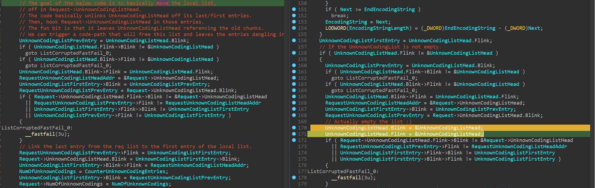

# CVE-2021-31166: HTTP Protocol Stack Remote Code Execution Vulnerability

This is a proof of concept for [CVE-2021-31166](https://msrc.microsoft.com/update-guide/vulnerability/CVE-2021-31166) ("HTTP Protocol Stack Remote Code Execution Vulnerability"), a use-after-free dereference in `http.sys` patched by Microsoft in May 2021. According to this [tweet](https://twitter.com/metr0/status/1392631376592076805) the vulnerability has been found by [@_mxms](https://twitter.com/_mxms) and [@fzzyhd1](https://twitter.com/fzzyhd1).


The bug itself happens in `http!UlpParseContentCoding` where the function has a local `LIST_ENTRY` and appends item to it. When it's done, it moves it into the `Request` structure; but it doesn't `NULL` out the local list. The issue with that is that an attacker can trigger a code-path that frees every entries of the local list leaving them dangling in the `Request` object.



Here is the bugcheck:

```
KDTARGET: Refreshing KD connection

*** Fatal System Error: 0x00000139
                       (0x0000000000000003,0xFFFFF90EA867EE40,0xFFFFF90EA867ED98,0x0000000000000000)

Break instruction exception - code 80000003 (first chance)

A fatal system error has occurred.
Debugger entered on first try; Bugcheck callbacks have not been invoked.

A fatal system error has occurred.

nt!DbgBreakPointWithStatus:
fffff804`19410c50 cc              int     3

kd> kp
 # Child-SP          RetAddr               Call Site
00 fffff90e`a867e368 fffff804`19525382     nt!DbgBreakPointWithStatus
01 fffff90e`a867e370 fffff804`19524966     nt!KiBugCheckDebugBreak+0x12
02 fffff90e`a867e3d0 fffff804`19408eb7     nt!KeBugCheck2+0x946
03 fffff90e`a867eae0 fffff804`1941ad69     nt!KeBugCheckEx+0x107
04 fffff90e`a867eb20 fffff804`1941b190     nt!KiBugCheckDispatch+0x69
05 fffff90e`a867ec60 fffff804`19419523     nt!KiFastFailDispatch+0xd0
06 fffff90e`a867ee40 fffff804`1db3f677     nt!KiRaiseSecurityCheckFailure+0x323
07 fffff90e`a867efd0 fffff804`1daf6c05     HTTP!UlFreeUnknownCodingList+0x63
08 fffff90e`a867f000 fffff804`1dacd201     HTTP!UlpParseAcceptEncoding+0x299c5
09 fffff90e`a867f0f0 fffff804`1daa93d8     HTTP!UlAcceptEncodingHeaderHandler+0x51
0a fffff90e`a867f140 fffff804`1daa8ab7     HTTP!UlParseHeader+0x218
0b fffff90e`a867f240 fffff804`1da04c5f     HTTP!UlParseHttp+0xac7
0c fffff90e`a867f3a0 fffff804`1da0490a     HTTP!UlpParseNextRequest+0x1ff
0d fffff90e`a867f4a0 fffff804`1daa48c2     HTTP!UlpHandleRequest+0x1aa
0e fffff90e`a867f540 fffff804`1932ae85     HTTP!UlpThreadPoolWorker+0x112
0f fffff90e`a867f5d0 fffff804`19410408     nt!PspSystemThreadStartup+0x55
10 fffff90e`a867f620 00000000`00000000     nt!KiStartSystemThread+0x28

kd> !analyze -v
[...]
*******************************************************************************
*                                                                             *
*                        Bugcheck Analysis                                    *
*                                                                             *
*******************************************************************************

KERNEL_SECURITY_CHECK_FAILURE (139)
A kernel component has corrupted a critical data structure.  The corruption
could potentially allow a malicious user to gain control of this machine.
Arguments:
Arg1: 0000000000000003, A LIST_ENTRY has been corrupted (i.e. double remove).
Arg2: fffff90ea867ee40, Address of the trap frame for the exception that caused the BugCheck
Arg3: fffff90ea867ed98, Address of the exception record for the exception that caused the BugCheck
Arg4: 0000000000000000, Reserved
```

## Frequently Asked Questions

**Q: Is [Windows Remote Management (WinRM)](https://docs.microsoft.com/en-us/windows/win32/winrm/portal) affected?**

Yes (thanks to [@JimDinMN](https://twitter.com/JimDinMN) for sharing [his experiments](https://twitter.com/JimDinMN/status/1395071966487269376)).

**Q: Is [Web Services on Devices (WSDAPI)](https://docs.microsoft.com/en-us/windows/win32/wsdapi/wsd-portal) affected?**

Yes (thanks to [@HenkPoley](https://twitter.com/HenkPoley) for sharing his [results](https://twitter.com/HenkPoley/status/1394309837304082439)).